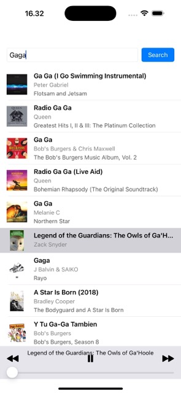

# SimpleItunesPlayer

SimpleItunesPlayer is an iOS application that allows users to search and play previews of songs from the iTunes API.

## 🚀 Features
- Search for songs using a keyword.
- Display search results with song details (name, artist, album, thumbnail).
- Play song previews.

## 📲 Requirements
- Xcode 15+
- iOS 16.0+
- Swift 5+
- Apple Developer Account (for distribution)

## 🛠 Technologies Used
- Swift
- UIKit
- MVVM Architecture
- Combine
- Unit Testing with XCTest
- Dependency Injection

## 🏗 Installation
### 1️⃣ Clone the Repository
```sh
git clone https://github.com/your-username/SimpleItunesPlayer.git
cd SimpleItunesPlayer
```

### 2️⃣ Open the Project
```sh
open SimpleItunesPlayer.xcodeproj
```

### 3️⃣ Run the App
Select a simulator or a connected device and press `Cmd + R` in Xcode.

## ✅ Testing
Run unit tests with:
```sh
Cmd + U (in Xcode)
```

## Screenshots


## 🏃 How to Run
There is `SimpleItunesPlayer.app` that can be pasted to simulator to test on simulator.

### 📋 Mock Testing Included:
- `MockSongsFetcherService`
- `MockSongAdapter`
- `HomePageViewModelTests`

## 🛠 Troubleshooting
- **Build errors?** Ensure you're using the correct Xcode and Swift version.

## 🙌 Contributing
Pull requests are welcome! For major changes, open an issue first to discuss.

## 📧 Contact
For any questions, reach out via [kevin9huang1994@example.com].


